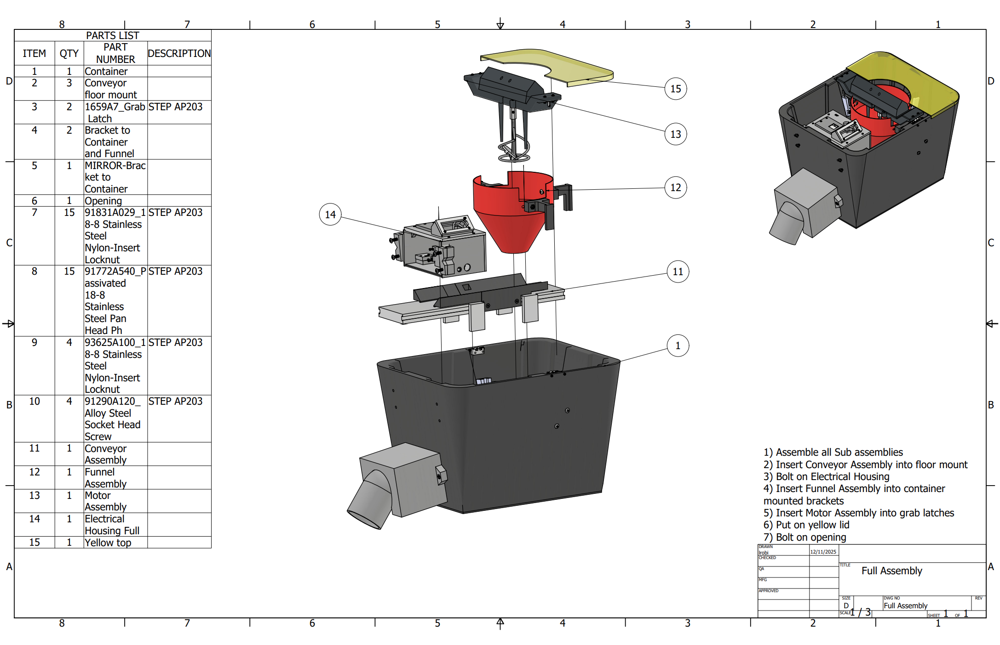
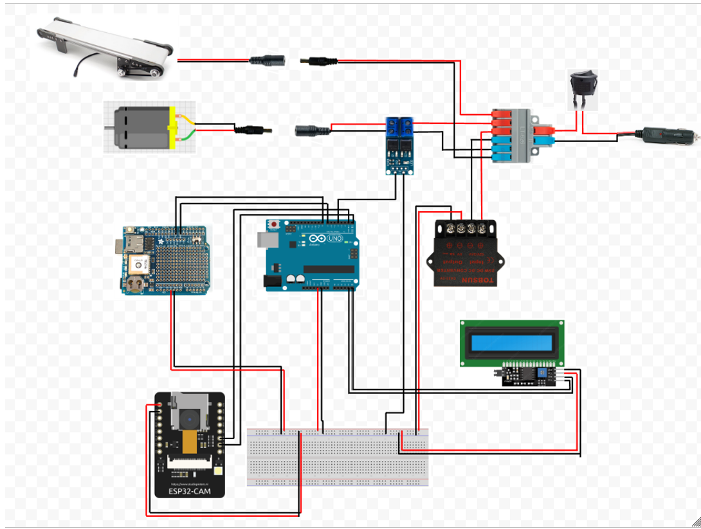
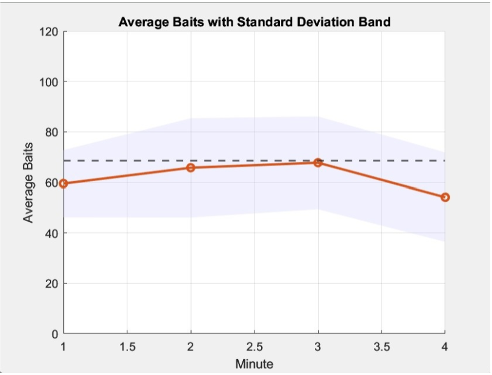

# USDA Helicopter Baiting Device

## Senior Design Project | CSU Mechanical Engineering | 2025

### Project Overview

Designed and prototyped an automated aerial oral rabies vaccine bait dispensing system for deployment from a rotary-wing aircraft.

The system was developed to dispense, count, and GPS-track oral rabies vaccine baits while remaining compact, lightweight, rugged, and practical for use by a helicopter co-pilot.

The final prototype combined mechanical design, 3D-printed components, conveyor-based material handling, embedded electronics, GPS tracking, and camera-based object detection.

---

## My Role

**Project Coordinator & Mechanical Engineer**

My responsibilities included:

- Coordinating project planning, schedules, and team communication
- Developing and evaluating mechanical design concepts
- Creating and modifying CAD models and assemblies
- Supporting component selection and procurement
- Developing the automated bait-feeding and sorting mechanism
- Working with Arduino and ESP32-CAM electronics
- Supporting GPS tracking and bait-counting functionality
- Developing and evaluating prototype components
- Planning and analyzing testing
- Communicating project progress with the USDA sponsor, faculty advisors, and project team

---

## Engineering Requirements

The design was developed around several primary customer requirements:

| Requirement | Target |
|---|---|
| Compact size | Fit comfortably on operator's lap |
| Lightweight | Target under 15 lb |
| Reliable dispensing | Consistent automated bait delivery |
| Automated dispensing rate | Approximately 68.5 baits/min |
| Counting | Desired minimum accuracy of 90% |
| Power | 12 V / 5 A aircraft power |
| Capacity | 12-gallon bait container |
| Maintenance | Easy access and cleaning |
| Ruggedness | Withstand handling and environmental exposure |
| Cost | Use low-cost, readily available components |

---

## Design Process

The project followed a structured engineering design process:

**Customer Requirements → Concept Generation → Concept Selection → CAD Development → Prototype Manufacturing → Electronics Integration → Testing → Design Evaluation**

### Concept Development

Multiple concepts were generated and evaluated using engineering decision-making tools including:

- Quality Function Deployment (QFD)
- Morphological analysis
- Pugh decision matrices
- Failure Modes and Effects Analysis (FMEA)
- Project scheduling and Gantt planning

---

## Mechanical Design

The final system used a **12-gallon Mighty Tote** as the primary container with an automated conveyor-based dispensing mechanism.

The mechanical system incorporated:

- Conveyor belt
- DC motor
- Grout-mixer agitator
- Custom 3D-printed components
- Funnel and bait-guiding components
- Electrical housing
- Removable assemblies for maintenance
- Stainless-steel and PETG components

The final unloaded prototype weighed approximately **12.6 lb**.

---

## Manufacturing

Custom components were primarily manufactured using **FDM 3D printing** rather than conventional machined components.

This approach allowed the team to:

- Rapidly iterate designs
- Produce complex geometries
- Reduce manufacturing cost
- Manufacture replacement components quickly
- Modify components as testing identified problems

The design also incorporated commercially available hardware and components to simplify procurement.

---

## Electronics & Controls

The electrical system integrated:

- Arduino UNO
- ESP32-CAM
- GPS logger
- I2C LCD
- Motor driver
- DC motor
- Buck converter
- SD-card data storage
- Manual power switch

The system was designed to operate from a **12 V / 5 A power source**.

The Arduino coordinated the motor control, display, GPS functionality, and communication with the ESP32-CAM.

---

## Testing & Results

Prototype testing was used to evaluate the dispensing mechanism, bait sorting, counting system, maintainability, and overall functionality.

The automated dispensing system was developed around a target rate of approximately **68.5 baits/min**.

Testing identified several areas where the prototype performed well, as well as areas requiring additional development.

### Counting System

The ESP32-CAM approach showed promise for detecting and counting individual baits, but the fully integrated system did not achieve the desired **90% counting accuracy**.

Integrated testing produced approximately **50% counting accuracy**, highlighting limitations in the camera-based processing approach.

This became an important design lesson: successful subsystem performance did not necessarily translate directly to successful full-system performance.

---

## Design Iterations

Several major design decisions changed as the project progressed.

### Container

The design transitioned from a Gamma2 Vittles Vault container to a **12-gallon Mighty Tote**.

The Mighty Tote provided easier procurement and required less modification while still meeting the project's capacity and size requirements.

### Agitation

An initial vibration-motor concept was evaluated but did not provide sufficient performance for reliably moving the baits.

The design was changed to a **DC motor-driven grout mixer**, which provided the necessary agitation for the dispensing system.

### Counting

Several counting approaches were considered, including infrared/laser sensing and camera-based detection.

The ESP32-CAM was selected because it offered the potential to identify multiple baits and distinguish bait groupings more effectively than a simple single-point sensor.

Testing ultimately showed that the integrated system needed greater processing capability to meet the desired counting performance.

---

## Key Results

- **Final prototype weight:** 12.6 lb
- **Container capacity:** 12 gallons
- **Target dispensing rate:** 68.5 baits/min
- **Desired counting accuracy:** 90%
- **Integrated counting accuracy:** ~50%
- **Final prototype cost:** $358.55
- **Total project expenditure:** $1,132.35
- **Original project budget:** $3,500

---

## Challenges & Lessons Learned

One of the most significant lessons from the project was the importance of evaluating the complete system rather than only individual subsystems.

The mechanical dispensing system and individual electronic components could perform their intended functions, but integrating the mechanical, electrical, sensing, and software systems introduced additional constraints.

The counting system in particular demonstrated the difference between a promising proof of concept and a validated production-ready solution.

Future development would focus on increasing processing capability, improving object detection reliability, and validating performance under a wider range of environmental and operating conditions.

---

## Project Presentation

The project was presented as part of CSU's Engineering Days (E-Days) senior design showcase.

---

## Project Documentation

Selected CAD models, drawings, photographs, testing data, and source code will be added to this repository to document the engineering development process.

---

## Tools & Technologies

**Mechanical Design**
- SolidWorks
- CAD assemblies and drawings
- FDM 3D printing

**Electronics & Controls**
- Arduino
- ESP32-CAM
- GPS
- LCD
- Motor control

**Engineering Analysis & Planning**
- Excel
- QFD
- Morphological analysis
- Pugh matrices
- FMEA
- Gantt scheduling

**Manufacturing & Prototyping**
- 3D printing
- CNC-related fixture development
- Hardware/component procurement
